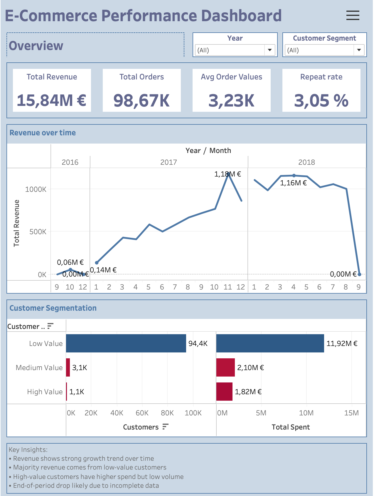
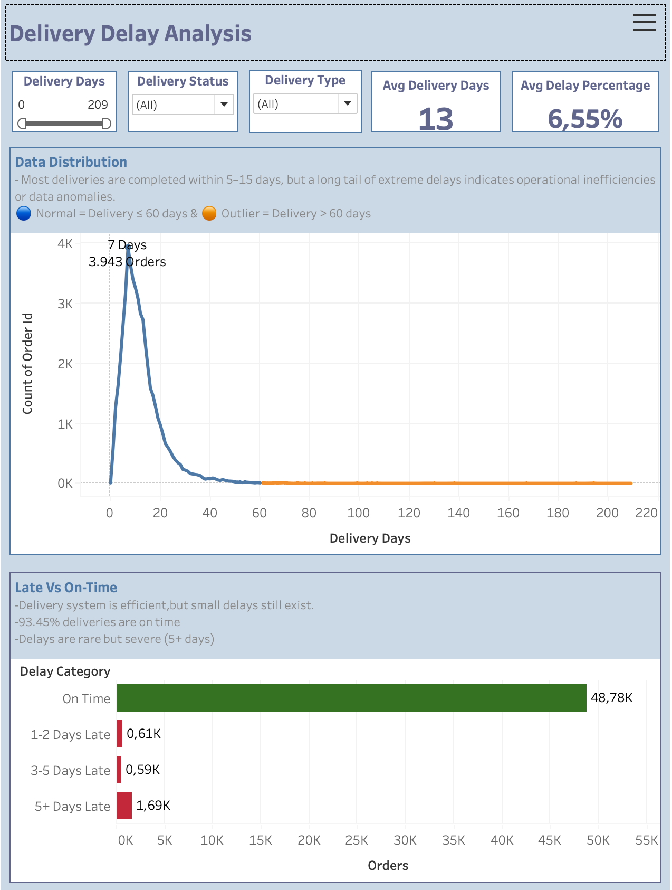
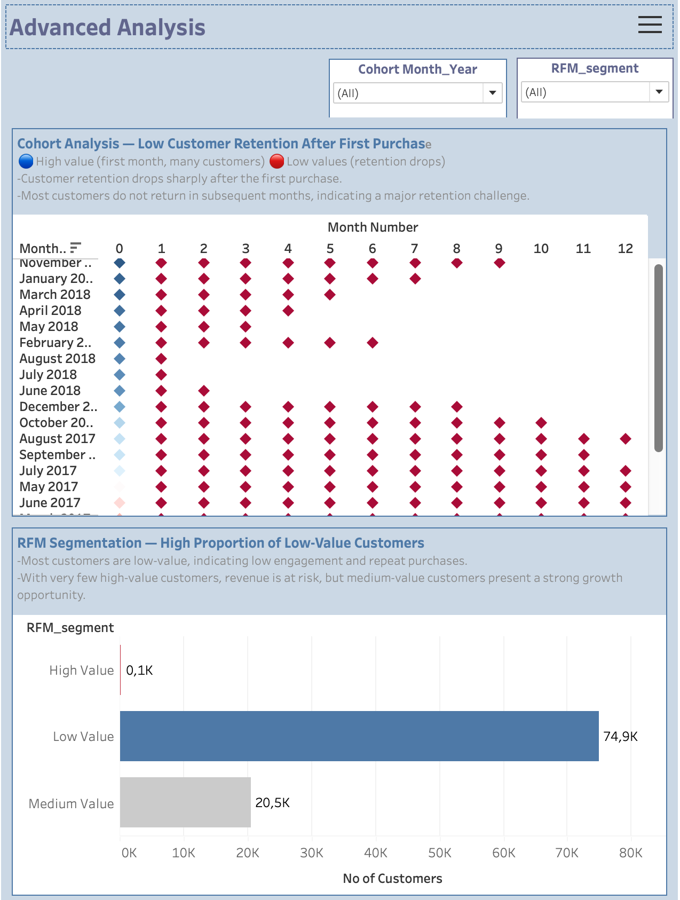
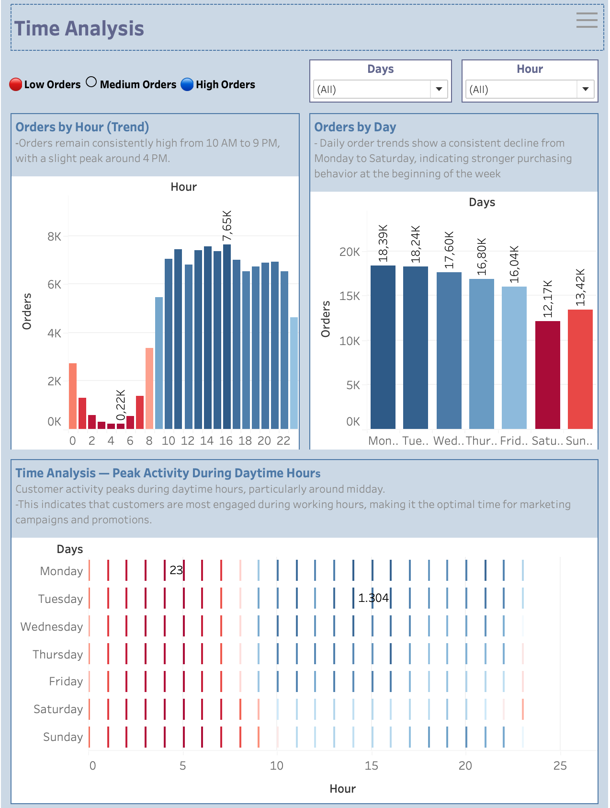

# 🛒 E-Commerce Analytics Dashboard

> **End-to-End Data Analytics Project** | Google Cloud (BigQuery) · Advanced SQL · Tableau

[](https://cloud.google.com/bigquery)
[](https://www.tableau.com/)
[](/)
[](https://www.kaggle.com/datasets/olistbr/brazilian-ecommerce)

---

## 📌 Overview

A complete analytics pipeline that transforms raw e-commerce data into actionable business insights — covering **customer behavior**, **revenue performance**, **delivery efficiency**, and **time-based purchasing patterns**.

The project demonstrates real-world data engineering skills: from ingesting raw CSV data into BigQuery, through advanced SQL modeling with window functions, to polished interactive Tableau dashboards.

Built using a 3-layer data architecture (Raw → Staging → Analytics) in Google BigQuery to ensure scalable and reproducible data processing.

---

## 🎯 Business Problem

Despite strong revenue, the business lacked visibility into key operational areas:

| Problem Area | Description |
|---|---|
| 🔁 Retention | Why do customers not return after their first purchase? |
| 💰 Customer Value | How is revenue distributed across customer segments? |
| 🚚 Delivery | Where are the inefficiencies and outliers in the delivery process? |
| ⏰ Timing | When are customers most active, and how should campaigns be timed? |

---

## 🔄 Data Pipeline

```
Kaggle CSV (Olist Dataset)
        ↓
Google Cloud — BigQuery (Raw Tables)
        ↓
Staging Layer (Data Cleaning & Transformation)
        ↓
Analytics Layer (KPI Tables)
        ↓
Tableau Dashboards (4 Views)
        ↓
Business Insights & Recommendations
```

---

## 🗂️ Data Source

**Dataset:** [Olist Brazilian E-Commerce](https://www.kaggle.com/datasets/olistbr/brazilian-ecommerce) (Kaggle)

Covers orders from **2016–2018**, including:

- 📦 ~100K orders
- 👥 Customer profiles
- 💳 Payment records
- 🚚 Delivery timestamps

---

## 🧠 Data Model

### Core Tables
| Table | Description |
|---|---|
| `fact_orders` | Central fact table with order-level data |
| `dim_customers` | Customer dimension with RFM segmentation |

### KPI Tables
| Table | Description |
|---|---|
| `kpi_revenue_summary` | Revenue aggregations over time |
| `kpi_delivery_performance` | Delivery time, delay metrics, and outlier flags |
| `kpi_rfm` | Recency, Frequency, Monetary segmentation scores |
| `kpi_cohort_analysis` | Monthly cohort retention rates |
| `kpi_time_analysis` | Hourly, daily, and heatmap order patterns |

---

## 🔥 Advanced SQL — Key Highlight

Window functions power the dynamic analytics layer, enabling percentage contributions, rankings, and time-based metrics without subqueries:

```sql
-- Time analysis: rank peak hours and calculate order share
SELECT
  EXTRACT(HOUR FROM order_date)            AS hour,
  COUNT(*)                                 AS orders,
  COUNT(*) * 100.0 / SUM(COUNT(*)) OVER () AS order_percentage,
  RANK() OVER (ORDER BY COUNT(*) DESC)     AS order_rank
FROM fact_orders
GROUP BY hour;
```

**Techniques used across the project:**

| Function | Use Case |
|---|---|
| `RANK() / DENSE_RANK()` | Identify peak hours and top segments |
| `SUM() OVER()` | Order and revenue contribution % |
| `DATE_DIFF()` | Recency scoring and delivery duration |
| `CASE WHEN` | RFM segmentation and delay categorisation |

---

## 📊 Dashboards

### 1. 🏠 Business Overview

Key performance metrics and revenue trend across 2016–2018, with customer segmentation breakdown.

| Metric | Value |
|---|---|
| Total Revenue | **€15.84M** |
| Total Orders | **~98.67K** |
| Avg Order Value | **€3.23K** |
| Repeat Rate | **3.05%** |

> **Insight:** Revenue grew strongly through 2017 into early 2018. Low-value customers (94.4K) dominate volume, but high-value customers (1.1K) punch above their weight in total spend.



---

### 2. 🚚 Delivery Performance

Delivery time distribution, on-time vs. late breakdown, and outlier detection.

| Metric | Value |
|---|---|
| Avg Delivery Time | **~13 days** |
| On-Time Delivery Rate | **93.45%** |
| Avg Delay Percentage | **6.55%** |
| Max Observed Delay | **209 days** |

**Delay Categories:**

| Category | Orders |
|---|---|
| On Time | 48.78K |
| 1–2 Days Late | 0.61K |
| 3–5 Days Late | 0.59K |
| 5+ Days Late | 1.69K |

> **Insight:** > Insight: The delivery system is efficient overall, but a small number of extreme delays create a long-tail distribution, significantly impacting average delivery time.



---

### 3. 📉 Advanced Analytics — Cohort & RFM

Cohort retention analysis and RFM customer segmentation.

**Cohort Analysis:**
- Retention drops sharply after the first purchase across all cohorts
- ~80–90% of customers do not return after their first purchase, indicating a retention-driven revenue gap.

**RFM Segmentation:**

| Segment | Customers |
|---|---|
| High Value | ~0.1K |
| Medium Value | ~20.5K |
| Low Value | ~74.9K |

> **Insight:** Over 85% of customers are low-value. Medium-value customers (20.5K) represent the highest growth opportunity — targeted upsell campaigns could meaningfully shift revenue.



---

### 4. ⏰ Time Analysis — Peak Activity During Daytime Hours

Hourly trends, day-of-week patterns, and a day–hour heatmap to identify peak activity windows.

| Metric | Finding |
|---|---|
| Peak Hour | **4 PM** (7.65K orders) |
| Active Window | **10 AM – 9 PM** |
| Strongest Day | **Monday** (18.39K orders) |
| Weakest Day | **Saturday** (12.17K orders) |

**Patterns from the heatmap:**
- Early morning (0–7 AM): consistently low activity across all days
- Midday–evening (10 AM–9 PM): sustained high volume, especially Mon–Wed
- Weekend afternoons show a noticeable drop-off vs. weekdays

> **Insight:** Customer activity is strongly tied to working hours and the start of the week. Marketing campaigns and promotions should be concentrated in the 10 AM–9 PM window, with emphasis on Monday and Tuesday.



---

## 📈 Key Insights Summary

| Area | Insight |
|---|---|
| ⏰ **Timing** | Peak activity 10 AM–9 PM; strongest Mon–Tue, weakest Saturday |
| 👥 **Retention** | ~80–90% of customers never return after their first purchase |
| 💰 **Revenue** | Driven by high volume of low-value customers; high-value are few but impactful |
| 🚚 **Delivery** | 93.45% on time; extreme outliers skew average delivery time to 13 days |
| 📊 **Segments** | Medium-value customers (20.5K) are the best conversion opportunity |

---

## 💡 Business Recommendations

1. **🔁 Boost Retention** — Implement post-purchase email flows, loyalty programmes, and re-engagement campaigns targeting lapsed customers
2. **📈 Convert Medium → High Value** — Identify medium-value customers' purchase patterns and build targeted upsell/cross-sell sequences
3. **⏰ Optimise Campaign Timing** — Concentrate ad spend between 10 AM–9 PM, prioritising Monday and Tuesday
4. **🚚 Investigate Delivery Outliers** — Audit logistics partners responsible for 60+ day delays; set automated SLA alerts
5. **🎯 Personalise with RFM** — Tailor messaging by segment: reward champions, re-engage at-risk, nurture medium-value prospects

---

## ▶️ How to Run

### 1. Download Dataset
```bash
kaggle datasets download -d olistbr/brazilian-ecommerce
unzip brazilian-ecommerce.zip -d data/raw_csv_files/
```


### 2. Upload Data to BigQuery (Raw Layer)

Raw CSV files are uploaded into Google BigQuery using the web UI.

***Steps:***

**Create datasets:**
```bash
ecommerce_raw
ecommerce_staging
ecommerce_analytics
```
Upload CSV files into ecommerce_raw:
```bash
olist_orders_dataset.csv
olist_customers_dataset.csv
olist_order_items_dataset.csv
olist_order_payments_dataset.csv
olist_products_dataset.csv
```
Enable schema auto-detection during upload.


### 3. Run SQL Scripts
**🔹 Step 1: Staging Layer (Data Cleaning)**

Run SQL scripts from:
```bash
/sql/ecommerce_staging/
```
Files:
```bash
stg_orders.sql
stg_order_items.sql
stg_products.sql
stg_customers.sql
stg_payments.sql
```
**🔹 Step 2: Analytics Layer (KPI Tables)**

Run SQL scripts from:
```bash
/sql/ecommerce_analytics/
```
Files:
```bash
kpi_revenue_summary.sql
kpi_delivery_performance.sql
kpi_rfm.sql
kpi_cohort_analysis.sql
kpi_time_analysis.sql
```
### 4. Connect Tableau
```bash
1. Open Tableau Deskto
2. Click Connect → To a Server → Google BigQuery
3. Sign in using your Google Cloud account
4. Navigate to your project and select dataset: ecommerce_analytics
5. Select and load the KPI tables as data sources
6. Click Load (or drag tables to the canvas) to start building visualizations
```
### 5. Open Dashboards
```
Olist_Ecommerce.twb
```
Or recreate manually using the KPI tables.

---

## 📁 Project Structure

```
ecommerce-analytics/
│
├── data/                     
│   └── raw_csv_files/       # Raw dataset from Kaggle (Olist CSV files)
│   │   ├── customers.csv
│   │   ├── products.csv
│   │   ├── order.csv
│   │   ├── order_items.csv
│   │   └── payments.csv
├── sql/
│   ├── ecommerce_staging/              # Data cleaning & transformation layer
│   │   ├── stg_orders.sql
│   │   ├── stg_order_items.sql
│   │   ├── stg_products.sql
│   │   ├── stg_customers.sql
│   │   └── stg_payments.sql
│   │
│   ├── ecommerce_analytics/                # Analytical / KPI layer
│   │   ├── kpi_revenue_summary.sql
│   │   ├── kpi_delivery_performance.sql
│   │   ├── kpi_rfm.sql
│   │   ├── kpi_cohort_analysis.sql
│   │   └── kpi_time_analysis.sql
│
├── dashboards/
│   └── tableau_workbook.twbx  # Final Tableau dashboards
│
└── README.md
```

---

## 🛠️ Tech Stack

| Tool | Role |
|---|---|
| **Google BigQuery** | Cloud-scale data warehouse and SQL execution |
| **SQL (Advanced)** | Window functions, aggregations, data modeling |
| **Tableau Desktop** | Interactive dashboard development |
| **Kaggle / Olist** | Raw e-commerce dataset |

---

## ⚠️ Challenges & Solutions

| Challenge | Approach |
|---|---|
| Missing delivery timestamps | Filtered and flagged nulls; excluded incomplete records from SLA metrics |
| Extreme delivery outliers (200+ days) | Applied 60-day threshold to separate normal vs. outlier distribution |
| Time-based consistency | Standardised timestamps in BigQuery before aggregation |
| Scaling to window function analytics | Incrementally refactored KPI queries, validating outputs at each step |

---

## 🏆 Outcomes

✅ Built a fully end-to-end data pipeline — from raw CSV to interactive dashboards  
✅ Applied advanced SQL window functions (`RANK`, `SUM OVER`, `DATE_DIFF`) in BigQuery at scale  
✅ Delivered **4 interactive Tableau dashboards** covering all major business dimensions  
✅ Uncovered a critical retention problem: 80–90% single-purchase customers  
✅ Translated data patterns into 5 concrete, prioritised business recommendations  

---

## 👤 Author

**Muthyala Tharun Teja**

[](https://linkedin.com/in/muthyalatharunteja)
[](https://github.com/muthyalatharunteja?tab=repositories)

